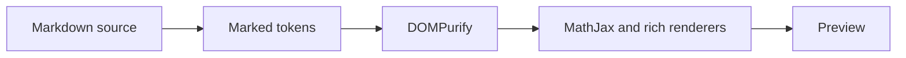
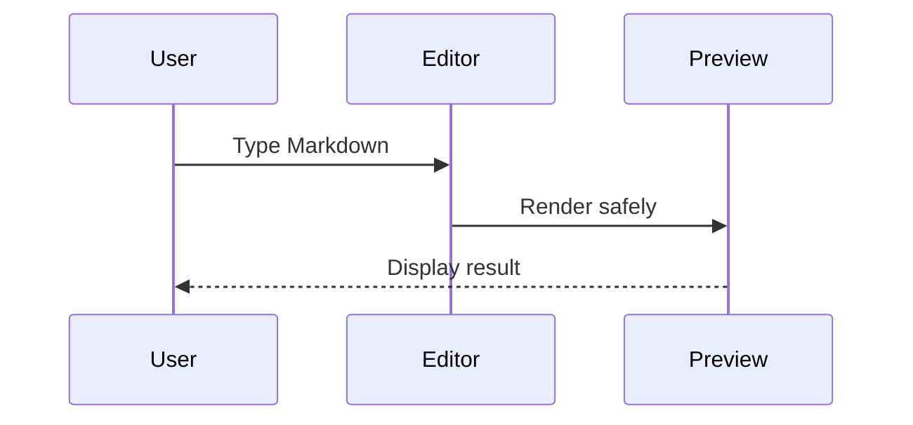
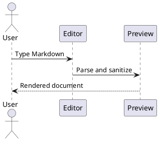
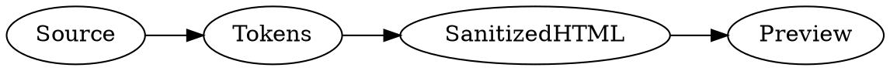

# Markdown Viewer Full Rendering Test Suite

> [!IMPORTANT]
> Open this file in **Split** or **Preview** mode. Every section states what should appear. Some diagrams, maps, emoji shortcodes, and external links require network access.

This document is a comprehensive manual rendering check for Markdown Viewer. It covers core Markdown, GitHub-Flavored Markdown (GFM), the viewer's supported extensions, all eleven cases from issue #245, and additional rendering defects found during the follow-up audit.

## Quick status checklist

- [ ] Frontmatter appears as metadata where the active flow supports it.
- [ ] The table of contents links jump to the intended unique headings.
- [ ] Text formatting and nesting look correct.
- [ ] Lists, tables, quotes, alerts, code, footnotes, and definition lists have the correct structure.
- [ ] Currency remains text while valid TeX renders with MathJax.
- [ ] No code content leaks into footnotes or math.
- [ ] Rich fences render, or show a clear loading/network error without breaking the rest of the preview.
- [ ] Unsafe HTML attributes are removed.
- [ ] There are no visible `MathJax error`, `&#36;`, raw parser tokens, or broken closing delimiters.

## Contents

1. [Headings and anchors](#1-headings-and-anchors)
2. [Paragraphs, breaks, and characters](#2-paragraphs-breaks-and-characters)
3. [Inline formatting](#3-inline-formatting)
4. [Lists and tasks](#4-lists-and-tasks)
5. [Blockquotes and alerts](#5-blockquotes-and-alerts)
6. [Links and images](#6-links-and-images)
7. [Tables](#7-tables)
8. [Code and token boundaries](#8-code-and-token-boundaries)
9. [Footnotes](#9-footnotes)
10. [Definition lists](#10-definition-lists)
11. [Raw HTML and sanitization](#11-raw-html-and-sanitization)
12. [Math and currency](#12-math-and-currency)
13. [Issue 245 exact regression index](#13-issue-245-exact-regression-index)
14. [Additional audit regressions](#14-additional-audit-regressions)
15. [Diagrams, maps, models, and music](#15-diagrams-maps-models-and-music)
16. [Final visual checklist](#16-final-visual-checklist)

---

## 1. Headings and anchors

Expected: six ATX heading levels, two Setext headings, unique duplicate IDs, Unicode-preserving IDs, and working internal links.

# Heading level 1

## Heading level 2

### Heading level 3

#### Heading level 4

##### Heading level 5

###### Heading level 6

Setext heading level 1
======================

Setext heading level 2
----------------------

### Heading with *italic*, **bold**, `code`, and [a link](https://example.com)

### Duplicate Anchor

First duplicate. Its ID should be `duplicate-anchor`.

### Duplicate Anchor

Second duplicate. Its ID should be `duplicate-anchor-1`.

### Duplicate Anchor

Third duplicate. Its ID should be `duplicate-anchor-2`.

[Jump to the first duplicate](#duplicate-anchor) · [Jump to the second duplicate](#duplicate-anchor-1) · [Jump to the third duplicate](#duplicate-anchor-2)

### 你好 世界

The ID should preserve the Chinese text as `你好-世界`.

### Café déjà vu

The ID should preserve accented Latin letters as `café-déjà-vu`.

### Привет мир

The ID should preserve Cyrillic letters as `привет-мир`.

### 🎉

An emoji-only heading should receive the fallback ID `heading`.

### 🎉

The duplicate emoji-only heading should receive `heading-1`.

[Jump to the Chinese heading](#你好-世界) · [Jump to the accented heading](#café-déjà-vu) · [Jump to the Cyrillic heading](#привет-мир) · [Jump to the emoji fallback](#heading)

---

## 2. Paragraphs, breaks, and characters

Expected: separate paragraphs retain their spacing and no punctuation is accidentally interpreted.

This is the first paragraph. It contains a long sentence so wrapping can be checked at narrow and wide preview widths without changing the underlying Markdown structure.

This is the second paragraph. It follows a blank line.

This line ends with two spaces.  
This should begin after a hard line break.

This line ends with a backslash.\
This should also begin after a hard line break.

These two source lines use an ordinary newline.
Markdown Viewer's configured GFM-break behavior should display the second source line on the next visual line.

### Escaped Markdown punctuation

Expected: the punctuation is visible and does not start formatting. Square brackets use numeric entities because `\[` and `\]` are supported MathJax display delimiters in Markdown Viewer:

\*literal asterisks\*, \_literal underscores\_, \# literal hash, &#91;literal brackets&#93;, \`literal backticks\`, \~literal tilde\~, and \\ literal backslash.

### Entities and Unicode

Named entities: &copy; &reg; &trade; &amp; &lt; &gt; &quot; &apos; &nbsp;.

Numeric entities: &#169; &#174; &#8482; &#9733; &#x1F680;.

Unicode scripts: English · हिन्दी · বাংলা · 日本語 · 한국어 · العربية · עברית · Ελληνικά · Українська.

Bidirectional sample: English before العربية في الوسط English after.

Symbols: © ® ™ ✓ ★ → ← ↑ ↓ € £ ¥ § ° ± × ÷ … — –.

Emoji characters: 😀 🚀 🎉 ✅ ⚠️ 🧪 📝.

Emoji shortcodes, when the emoji toolkit is available: :rocket: :tada: :warning: :memo: :white_check_mark:.

---

## 3. Inline formatting

Expected: each style affects only its delimited content.

### Emphasis basics

*asterisk italic* and _underscore italic_.

**asterisk bold** and __underscore bold__.

***bold italic*** and ___bold italic___.

~~strikethrough~~, ==highlight==, ^superscript^, and ~subscript~.

### Nested and adjacent formatting

**Bold with *nested italic* and `nested code`.**

*Italic with **nested bold** and ~~nested deletion~~.*

~~Deleted with **bold** inside.~~

==Highlighted with **bold**, *italic*, and `code` inside.==

Normal**bold immediately adjacent**normal and normal*italic immediately adjacent*normal.

H~2~O, CO~2~, x^2^, 10^6^, and E = mc^2^ outside math.

### Delimiter boundary cases

Expected: these remain ordinary text when the custom delimiter is incomplete or contains forbidden edge whitespace.

Unclosed *italic, unclosed **bold, unclosed ~~strike, unclosed ==highlight, unclosed ^superscript, and unclosed ~subscript.

Whitespace boundaries: == not highlighted==, ^ not superscript^, and ~ not subscript~.

### Inline code

Use `const answer = 42;`, `**not bold**`, `==not highlighted==`, `$not math$`, and `[^not-a-footnote]` as literal inline code.

Use double backticks for a code span containing a backtick: ``const marker = `code`;``.

An empty-looking code span with spaces: `  `.

### Inline HTML formatting

Press <kbd>Ctrl</kbd> + <kbd>S</kbd>. This is an <abbr title="Application Programming Interface">API</abbr>, an <mark>HTML mark</mark>, an <ins>insertion</ins>, a <del>deletion</del>, H<sub>2</sub>O, and x<sup>2</sup>.

---

## 4. Lists and tasks

### Tight unordered list

- Alpha
- Bravo
- Charlie

### Marker changes create separate lists

Expected: the following source creates three separate top-level lists.

- Hyphen item one
- Hyphen item two
* Asterisk item one
* Asterisk item two
+ Plus item one
+ Plus item two

### Nested unordered list

- Parent A
  - Child A.1
    - Grandchild A.1.a
    - Grandchild A.1.b
  - Child A.2
- Parent B
  * Child B.1 with a different nested marker
    + Grandchild B.1.a

### Loose list with multiple blocks

- First loose item

  This continuation paragraph belongs to the first list item.

  > This quote also belongs to the first item.

      Indented code inside the first item.

- Second loose item

  Second-item continuation paragraph.

### Ordered lists

#### Sequential markers

1. First
2. Second
3. Third

#### List starting at five

5. Starts at five
6. Continues at six
7. Continues at seven

#### Parenthesis markers

1) Parenthesis marker one
2) Parenthesis marker two
3) Parenthesis marker three

#### Nested ordered list

1. Parent ordered item
   1. Nested ordered item
   2. Another nested ordered item
2. Second parent item

### Task lists

- [x] Completed task
- [X] Completed task with uppercase X
- [ ] Incomplete task
- [ ] Parent task
  - [x] Completed child
  - [ ] Incomplete child

### Mixed content inside a list item

1. **Formatted text** with [a link](https://example.com).
2. Inline code: `npm test`.
3. Inline math: $x^2 + y^2 = z^2$.
4. A nested table:

   | Key | Value |
   | --- | ---: |
   | A | 1 |
   | B | 2 |

---

## 5. Blockquotes and alerts

### Basic and nested blockquotes

> A single-paragraph blockquote.

> A blockquote with multiple lines.
> The second source line should remain in the same quote.
>
> A second paragraph inside the quote.
>
> - A list inside the quote
> - A second list item
>
> > A nested blockquote.

### GitHub alerts

> [!NOTE]
> Useful background information should render as a Note alert.

> [!TIP]
> A helpful suggestion should render as a Tip alert.

> [!IMPORTANT]
> Something the reader should not miss should render as Important.

> [!WARNING]
> A risk or possible problem should render as a Warning.

> [!CAUTION]
> A serious warning should render as Caution.

### Horizontal rules

Expected: three horizontal rules follow, separated by labels.

Hyphen rule:

---

Asterisk rule:

***

Underscore rule:

___

---

## 6. Links and images

### Inline, title, autolink, and reference links

[Markdown Viewer repository](https://github.com/ThisIs-Developer/Markdown-Viewer)

[Link with a title](https://example.com "Example title")

Angle autolink: <https://example.com/path?query=markdown#fragment>

GFM bare URL: https://example.com/bare-url

Email autolink: <qa@example.com>

[Reference link][viewer-repository]

[Collapsed reference][]

[Shortcut reference]

[viewer-repository]: https://github.com/ThisIs-Developer/Markdown-Viewer "Repository"
[collapsed reference]: https://example.com/collapsed
[shortcut reference]: https://example.com/shortcut

### Internal links

[Back to the document title](#markdown-viewer-full-rendering-test-suite)

[Jump to Issue 10](#issue-10-color-scoping)

### Images

Expected: the local icon loads with its alt text and optional title.


Reference image:

![Markdown Viewer reference icon][viewer-icon]

[viewer-icon]: assets/icon.jpg "Reference image"

Expected broken-image behavior with visible alt text:


### Image inside a link

[](https://github.com/ThisIs-Developer/Markdown-Viewer)

---

## 7. Tables

### Alignment and inline formatting

| Left aligned | Center aligned | Right aligned | Formatting |
| :--- | :---: | ---: | --- |
| Alpha | Center | 1 | **bold** |
| Bravo | Middle | 20 | *italic* |
| Charlie | Center | 300 | `code` |
| Delta | Middle | 4,000 | ~~deleted~~ |
| Echo | Center | 50,000 | [link](https://example.com) |

### Escaped pipes and code pipes

| Test | Expected result |
| --- | --- |
| Escaped pipe | A \| B |
| Code pipe | `left | right` |
| Entity pipe | left &#124; right |

### Empty and wide cells

| First | Second | Third | Fourth | Fifth |
| --- | --- | --- | --- | --- |
| value |  | value |  | value |
| A long cell that should wrap without breaking the table layout | Compact | Another long cell containing several words for responsive-width testing | 123 | End |

---

## 8. Code and token boundaries

Expected: every code example remains literal. Math, footnotes, emphasis, and raw HTML must not activate inside code.

### Plain fenced code

```
Plain text fence
**not bold**
==not highlighted==
$x^2$ is not MathJax here
[^code-note]: not a footnote
<script>not executable</script>
```

### JavaScript highlighting

```javascript
function renderMarkdown(source) {
  const escapedPrice = "\\$20";
  const footnoteLikeText = "[^code]: literal";
  return { source, escapedPrice, footnoteLikeText };
}

console.log(renderMarkdown("# Heading"));
```

### TypeScript highlighting

```typescript
type RenderResult = {
  html: string;
  warnings: string[];
};

const result: RenderResult = { html: "<p>Safe</p>", warnings: [] };
```

### JSON highlighting

```json
{
  "name": "Markdown Viewer",
  "features": ["GFM", "MathJax", "diagrams"],
  "safe": true,
  "count": 42
}
```

### HTML highlighting

```html
<article data-test="literal">
  <h1>Code, not rendered HTML</h1>
  <script>alert("must not run")</script>
</article>
```

### CSS highlighting

```css
.markdown-body {
  color: var(--text-color);
  max-width: 980px;
}
```

### Bash terminal block

```bash
set -euo pipefail
npm run check:static
npm run test:e2e
```

### PowerShell terminal block

```powershell
$ErrorActionPreference = 'Stop'
npm run check:static
npm run test:e2e
```

### Diff highlighting

```diff
- old global regex preprocessing
+ token-aware Markdown extensions
```

### Unknown language fallback

```not-a-real-language
This should render as safe plaintext with a code toolbar.
```

### Tilde fence

~~~markdown
# This heading stays code

- This list stays code
- $20 and $x^2$ stay code
~~~

### Indented code block

    line one

    line two after a blank code line

### Exact dollar and footnote boundary test

```md
Options ran \$20, \$45, and \$99.
[^fenced]: must stay code
Before $x_1^2$ after
```

Inline boundary test: `\$20`, `[^inline]: must stay code`, `$x^2$`, `^outside^`, and `==outside==` must all stay literal.

---

## 9. Footnotes

Expected: defined notes are numbered by first reference, labels match case-insensitively, repeated references share a number and receive separate back-links, and undefined calls remain literal.

Basic footnote reference.[^basic]

Named footnote reference.[^named-note]

Repeated reference first call.[^repeat] Repeated reference second call.[^REPEAT] Repeated reference third call.[^repeat]

Case-insensitive call using uppercase label.[^CaseLabel]

This undefined call must stay literal: [^missing].

Slug-collision labels must still create distinct notes: first[^a!] and second[^a?].

Footnote-like inline code remains code: `[^not-a-note]` and `[^not-a-definition]: literal`.

[^basic]: A basic footnote body.

[^named-note]: A named footnote containing **bold**, *italic*, `code`, and [a link](https://example.com).

[^repeat]: This one definition has three references and should show three return links.

[^caselabel]: The differently cased definition should match `[^CaseLabel]`.

[^a!]: First punctuation-label definition.

[^a?]: Second punctuation-label definition with a slug that must not collide.

[^multiline]: A multiline definition begins here.

  This indented continuation remains in the same definition.

  A final continuation paragraph with $x^2$ and `inline code`.

Multiline note reference.[^multiline]

---

## 10. Definition lists

Definition lists are a supported Markdown Extra extension, not core GFM.

### Single term and definition

Markdown
: A lightweight markup language.

### One term with multiple definitions

Renderer
: A component that converts source into output.
: In this application, the preview pipeline built around Marked, MathJax, and DOMPurify.

### Multiple terms sharing definitions

Term A
Term B
: Shared definition for both terms above.
: Alternate shared definition.

### Inline formatting in terms and definitions

**Formatted term**
: Definition with *italic*, `code`, [a link](https://example.com), and $x^2$.

### GFM/CommonMark precedence boundaries

Expected: none of these constructs becomes a definition list.

1) Ordered item
: This is a lazy continuation inside the ordered list item, not a definition list.

Setext boundary heading
-----------------------
: This is a paragraph after the heading, not a definition.

***
: This is a paragraph after a thematic break.

    indented code boundary
: This is a paragraph after indented code.

[boundary-reference]: https://example.com/boundary
: This is a paragraph after a reference definition.

[Reference definition still works][boundary-reference].

| Boundary A | Boundary B |
| --- | --- |
| : table row | second cell |

---

## 11. Raw HTML and sanitization

### Safe raw HTML

<details>
  <summary>Open this details element</summary>
  <p>The hidden paragraph contains <strong>bold HTML</strong> and <code>code HTML</code>.</p>
</details>

<p style="text-align: center">Centered raw HTML paragraph.</p>

<p style="text-align: right">Right-aligned raw HTML paragraph.</p>

<table>
  <thead>
    <tr>
      <th rowspan="2">Raw HTML</th>
      <th colspan="2">Merged columns</th>
    </tr>
    <tr>
      <th>Left</th>
      <th>Right</th>
    </tr>
  </thead>
  <tbody>
    <tr>
      <td>Body</td>
      <td>A</td>
      <td>B</td>
    </tr>
  </tbody>
</table>

### Multiline HTML comment

Expected: only “Visible after comment” appears; neither hidden line is rendered.

<!--
hidden first line

hidden second line
-->

Visible after comment.

### Sanitization checks

Expected: the elements remain safe, but `onclick`, `onload`, and `javascript:` are removed. Do not see a script alert.

<span onclick="void 0" data-safe-marker="kept-if-allowed">Harmless span; unsafe event attribute should be stripped.</span>


<a href="javascript:void(0)" title="Unsafe scheme should be removed">Unsafe-scheme link text</a>

The following dangerous examples are fenced code and must never execute:

```html
<script>alert("unsafe")</script>

<iframe srcdoc="<script>alert('unsafe')</script>"></iframe>
```

---

## 12. Math and currency

### Currency must remain text

Expected: no MathJax appears in these price sentences.

Options ran $20, $45, and $99 for the three tiers.

The cart contains $5, $10, $25, and $100 items.

Escaped prices cost \$20, \$45, and \$99.

Reviewer follow-up without comma boundaries: We spent \$20 which caused \$45 of loss and \$99.

Mixed currency and math: $20 plus $x^2$.

Digit adjacency after math remains literal where required: $x$5.

### Inline math delimiters

Dollar math: $E = mc^2$.

Parenthesis delimiter: \(a^2 + b^2 = c^2\).

Bracket delimiter: \[x = \frac{-b \pm \sqrt{b^2 - 4ac}}{2a}\].

Two expressions on one line: $x_1^2$ then $x_2^2$.

A dollar inside TeX: $\sqrt{\$4} = 2$.

### Display math

$$
\int_a^b f(x)\,dx = F(b) - F(a)
$$

$$
\sum_{i=1}^{n} i = \frac{n(n+1)}{2}
$$

$$
\begin{bmatrix}
a & b \\
c & d
\end{bmatrix}
\begin{bmatrix}
x \\
y
\end{bmatrix}
=
\begin{bmatrix}
ax + by \\
cx + dy
\end{bmatrix}
$$

$$
f(x) =
\begin{cases}
x^2, & x \ge 0 \\
-x, & x < 0
\end{cases}
$$

### Fenced math

```math
\prod_{k=1}^{n} k = n!
```

### Escapes, braces, subscripts, and superscripts

Expected: every expression renders without leaking formatting into adjacent prose.

Before text $right\_ascension = 5h35m$ after text.

Before text $x_1^2 + x_2^2 = r^2$ after text.

Before text $\left\{ x \mid x > 0 \right\}$ after text.

Before text $\left(\frac{a}{b}\right)$ and $\left[\sum_i x_i\right]$ after text.

### Color scoping

Legacy two-group compatibility form:

$\color{red}{v\^2} \color{blue}{G}M\left(\color{green}{\frac{2}{r}} - \color{purple}{\frac{1}{a}}\right)$

Expected: only `v²` is red, only `G` is blue, only `2/r` is green, only `1/a` is purple; `M`, the minus sign, parentheses, and surrounding content use the default color.

Standard grouped color switch:

${\color{red}v^2} + {\color{blue}G}M + z$

Standard ungrouped switch, which intentionally colors the rest of its TeX group:

$\color{orange} x + y$

Standard `\textcolor`:

$\textcolor{teal}{A_{nested}} + B$

Nested legacy groups:

$\color{red}{outer \color{blue}{inner} outer} + z$

---

## 13. Issue 245 exact regression index

This section repeats the exact or equivalent reporter cases in one compact visual checklist.

### Issue 1: duplicate heading IDs

#### Test

First test section.

#### Test

Second test section.

[Jump to the second test](#test-1) · [Jump to the first test](#test)

Expected: both links target different headings.

### Issue 2: mixed bullet markers

- List 1, item 1
- List 1, item 2
* List 2, item 1

Expected: two separate list elements with a clearly visible gap between them.

### Issue 3: unrelated currency dollars

Options ran $20, $45, and $99 for the three tiers.

We spent \$20 which caused \$45 of loss and \$99.

Expected: both sentences show plain currency with no inline math. Escaping with `\$` is the deterministic form for ambiguous prose.

### Issue 4: escaped dollars inside code

```md
Options ran \$20, \$45, and \$99.
```

Expected: the code displays backslashes and dollar signs, never `&#36;`.

### Issue 5: footnotes inside code

Inline code: `[^label]: this is literal code` and `[^label]`.

```md
[^fenced]: this is literal fenced code
Reference[^fenced]
```

Expected: no footnote is created from any code content.

### Issue 6: multiple definition terms

Issue term A
Issue term B
: Shared definition for both issue terms.

Expected: one definition list containing two terms.

### Issue 7: carets inside inline TeX

Before text $x_1^2$ then $x_2^2$ after text.

Expected: two correct formulas and unchanged surrounding text.

### Issue 8: escaped underscore inside TeX

Before text $right\_ascension = 5h35m$ after text.

Expected: a literal underscore in the identifier.

### Issue 9: automatically sized curly braces

Before text $\left\{ x \mid x > 0 \right\}$ after text.

Expected: correctly sized braces and no MathJax error.

### Issue 10: color scoping

$\color{red}{v\^2} \color{blue}{G}M\left(\color{green}{\frac{2}{r}} - \color{purple}{\frac{1}{a}}\right)$

Expected: colors stop at their closing braces.

### Issue 11: inline and display parity

Display form:

$$
A_cE\left\{-\dfrac{du(x_1)}{dx},\ \dfrac{du(x_2)}{dx}\right\}
$$

Inline form:

$A_cE\left\{-\dfrac{du(x_1)}{dx},\ \dfrac{du(x_2)}{dx}\right\}$

Expected: both forms render the same mathematical structure.

---

## 14. Additional audit regressions

### Unicode heading IDs

Already exercised by [你好 世界](#你好-世界), [Café déjà vu](#café-déjà-vu), and [Привет мир](#привет-мир).

Expected: internal links resolve and accents/non-Latin characters are not discarded.

### Undefined, mixed-case, repeated, and colliding footnotes

Already exercised in [Footnotes](#9-footnotes).

Expected: undefined calls stay literal, label matching is case-insensitive, every repeated call has a return link, and punctuation labels do not produce duplicate IDs.

### Loose list and indented-code continuity

- Worker-sensitive first item

  Continuation paragraph after a blank line.

- Worker-sensitive second item

Expected: one loose list, not two lists separated by a standalone paragraph.

    worker-sensitive code line one

    worker-sensitive code line two

Expected: one indented code block containing both lines and the blank line.

### Multiline HTML comment continuity

<!--
worker-hidden first

worker-hidden second
-->

Worker-visible content after the comment.

Expected: neither hidden line leaks into the preview.

### Definition-list precedence

Already exercised in [GFM/CommonMark precedence boundaries](#gfmcommonmark-precedence-boundaries).

Expected: lists, Setext headings, rules, indented code, references, and tables retain their original block types.

---

## 15. Diagrams, maps, models, and music

> [!NOTE]
> PlantUML, D2, Graphviz, Vega-Lite, and WaveDrom may use remote rendering. A network failure should be contained to that diagram and must not break later sections.

### Mermaid flowchart



### Mermaid sequence diagram



### PlantUML



### D2

```d2
editor: Markdown Editor
parser: Marked + Extensions
sanitizer: DOMPurify
preview: Live Preview

editor -> parser -> sanitizer -> preview
```

### Graphviz / DOT



### Vega-Lite

```vega-lite
{
  "$schema": "https://vega.github.io/schema/vega-lite/v5.json",
  "description": "Rendering test results",
  "data": {
    "values": [
      {"category": "Core Markdown", "tests": 24},
      {"category": "Extensions", "tests": 12},
      {"category": "Math", "tests": 16},
      {"category": "Rich fences", "tests": 10}
    ]
  },
  "mark": "bar",
  "encoding": {
    "x": {"field": "category", "type": "nominal", "sort": null},
    "y": {"field": "tests", "type": "quantitative"},
    "color": {"field": "category", "type": "nominal", "legend": null}
  }
}
```

### WaveDrom

```wavedrom
{ signal: [
  { name: "clk",   wave: "p......." },
  { name: "parse", wave: "01..0..." },
  { name: "safe",  wave: "0...1.0." },
  { name: "view",  wave: "0....1.." }
]}
```

### Markmap

```markmap
# Rendering Test
## Core Markdown
### Text
### Lists
### Tables
## Extensions
### Footnotes
### Definition Lists
### Alerts
## Rich Content
### Math
### Diagrams
### Maps
### Music
```

### GeoJSON

```geojson
{
  "type": "FeatureCollection",
  "features": [
    {
      "type": "Feature",
      "properties": {"name": "Taj Mahal"},
      "geometry": {
        "type": "Point",
        "coordinates": [78.0421, 27.1751]
      }
    },
    {
      "type": "Feature",
      "properties": {"name": "Test route"},
      "geometry": {
        "type": "LineString",
        "coordinates": [
          [78.0321, 27.1651],
          [78.0421, 27.1751],
          [78.0521, 27.1851]
        ]
      }
    }
  ]
}
```

### TopoJSON

```topojson
{
  "type": "Topology",
  "objects": {
    "example": {
      "type": "GeometryCollection",
      "geometries": [
        {
          "type": "Point",
          "coordinates": [2.2945, 48.8584],
          "properties": {"name": "Eiffel Tower"}
        }
      ]
    }
  },
  "arcs": [],
  "transform": {
    "scale": [1, 1],
    "translate": [0, 0]
  }
}
```

### STL 3D model

```stl
solid pyramid
  facet normal 0 0 -1
    outer loop
      vertex 0 0 0
      vertex 1 1 0
      vertex 1 0 0
    endloop
  endfacet
  facet normal 0 0 -1
    outer loop
      vertex 0 0 0
      vertex 0 1 0
      vertex 1 1 0
    endloop
  endfacet
  facet normal 0 -1 1
    outer loop
      vertex 0 0 0
      vertex 1 0 0
      vertex 0.5 0.5 1
    endloop
  endfacet
  facet normal 1 0 1
    outer loop
      vertex 1 0 0
      vertex 1 1 0
      vertex 0.5 0.5 1
    endloop
  endfacet
  facet normal 0 1 1
    outer loop
      vertex 1 1 0
      vertex 0 1 0
      vertex 0.5 0.5 1
    endloop
  endfacet
  facet normal -1 0 1
    outer loop
      vertex 0 1 0
      vertex 0 0 0
      vertex 0.5 0.5 1
    endloop
  endfacet
endsolid pyramid
```

### ABC music notation

```abc
X:1
T:Rendering Test Scale
M:4/4
L:1/4
Q:1/4=120
K:C
C D E F | G A B c | c B A G | F E D C |
```

---

## 16. Final visual checklist

### Core structure

- [ ] Heading levels are visually distinct.
- [ ] Duplicate and Unicode heading links target the right section.
- [ ] Paragraph, break, entity, Unicode, and bidirectional text is readable.
- [ ] Emphasis, deletion, highlight, superscript, subscript, and code remain correctly scoped.
- [ ] Tight, loose, nested, ordered, mixed-marker, and task lists retain structure.
- [ ] Quotes, nested quotes, and all five alert types render.
- [ ] Links, references, internal anchors, local images, and broken-image alt text behave safely.
- [ ] Tables align and remain usable at narrow widths.

### Parser boundaries

- [ ] Code never activates math, HTML, footnotes, or custom inline formatting.
- [ ] Undefined footnotes remain literal.
- [ ] Repeated footnotes show multiple return links.
- [ ] Definition lists do not consume unrelated GFM/CommonMark blocks.
- [ ] Multiline comments stay hidden.
- [ ] Unsafe raw HTML attributes and URL schemes are removed.

### Math and issue #245

- [ ] Currency is plain text.
- [ ] Inline, display, bracket, parenthesis, and fenced math render.
- [ ] Carets, underscores, subscripts, superscripts, and auto-sized braces work.
- [ ] Legacy and standard color forms have the documented scope.
- [ ] The issue #245 inline/display expression has structural parity.
- [ ] No MathJax error appears anywhere.

### Rich content

- [ ] Mermaid and Markmap render locally when their libraries are available.
- [ ] Remote diagrams render or fail locally without damaging the document.
- [ ] GeoJSON and TopoJSON maps initialize.
- [ ] The STL model is visible and interactive.
- [ ] ABC notation renders sheet music.
- [ ] Rich-content toolbars remain usable in Split and Preview modes.

## End of rendering suite

If every applicable checkbox passes and the browser console contains no relevant rendering error, the visual rendering audit is complete.
