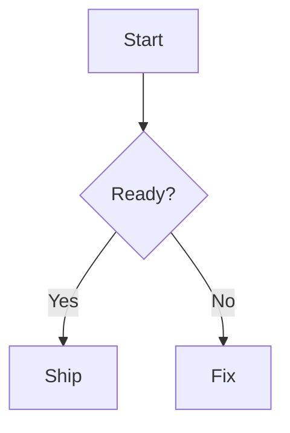
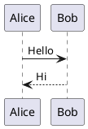
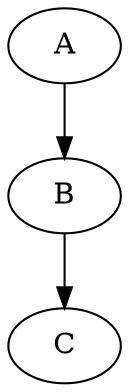

# GitHub-Flavored Markdown Reference: GFM, Diagrams, Math, Maps, STL, and ABC

Markdown Viewer supports standard Markdown, GitHub-Flavored Markdown (GFM), selected custom inline extensions, LaTeX math, GitHub alerts, frontmatter, and many fenced-code renderers. This makes it useful for README files, documentation, notes, tables, task lists, code blocks, math, Mermaid, PlantUML, Graphviz/DOT, D2, Vega-Lite, WaveDrom, Markmap, maps, STL 3D models, ABC notation, and other content people often preview before exporting or sharing.

All rendered HTML is sanitized before display. Raw HTML is useful for formatting, but scripts and unsafe event handlers are removed. The preview is GitHub-style and GFM-oriented, not a promise of byte-for-byte identical rendering to GitHub, Pandoc, Obsidian, Typora, or other Markdown tools.

For editing workflows, see [Usage Guide](Usage-Guide.md). For renderer network and privacy boundaries, see [Privacy and Security](Privacy-and-Security.md).

## Core Markdown and GFM

### Headings

```markdown
# Heading 1
## Heading 2
### Heading 3
#### Heading 4
##### Heading 5
###### Heading 6

Setext Heading 1
================

Setext Heading 2
----------------
```

Heading ids are generated from heading text so links like `[Jump](#heading-2)` can scroll inside the preview.

### Paragraphs and Line Breaks

Separate paragraphs with a blank line. End a line with two spaces or a backslash for a hard line break.

```markdown
First paragraph.

Second paragraph.

Line one\
Line two
```

### Emphasis

```markdown
*italic*
_italic_
**bold**
__bold__
***bold italic***
~~strikethrough~~
```

Custom inline extensions:

```markdown
==highlight==
^superscript^
~subscript~
```

### Blockquotes

```markdown
> A quote.
>
> > A nested quote.
```

GitHub alert blocks are also written as blockquotes. See [Alerts](#alerts).

### Lists and Task Lists

```markdown
- Item
- Item
  - Nested item

1. First
2. Second
   1. Nested

- [x] Done
- [ ] Not done
```

The editor continues Markdown lists when you press Enter and exits a list when you press Enter on an empty list item.

### Code

Inline:

```markdown
Use `const value = 1`.
```

Fenced code:

````markdown
```javascript
console.log("Hello");
```
````

Highlight.js colors known languages. Unknown languages fall back to plaintext.

### Links and Images

```markdown
[GitHub](https://github.com)
[GitHub with title](https://github.com "GitHub")
[Reference link][repo]


![Reference image][logo]

[repo]: https://github.com/ThisIs-Developer/Markdown-Viewer
[logo]: ../assets/icon.jpg
```

Links and images can request external resources when opened or rendered.

### Tables

```markdown
| Name | Count | Price |
| :--- | :---: | ---: |
| Editor | 1 | $0 |
| Exporter | 2 | $0 |
```

### Horizontal Rules

```markdown
---
***
___
```

## Extended Markdown

### Footnotes

```markdown
This sentence has a footnote.[^1]

[^1]: Footnotes can contain multiple paragraphs.

    Indented continuation lines are part of the note.
```

Footnotes render at the bottom with back-reference links. Multi-paragraph footnotes are supported.

### Definition Lists

```markdown
Term
: Definition text
: Another definition for the same term
```

### Frontmatter

YAML frontmatter can be placed at the top of a document.

```markdown
---
title: Project Notes
status: Draft
tags:
  - markdown
  - docs
---

# Body
```

HTML export parses frontmatter and renders it as a table before the document body.

### Raw HTML

```html
<details>
  <summary>Open me</summary>
  <p>Hidden content.</p>
</details>

<kbd>Ctrl</kbd> + <kbd>S</kbd>
<abbr title="Application Programming Interface">API</abbr>
```

DOMPurify sanitization removes unsafe tags and attributes. Inline scripts and handlers such as `onclick` are not preserved.

### Alerts

```markdown
> [!NOTE]
> Useful background information.

> [!TIP]
> A helpful suggestion.

> [!IMPORTANT]
> Something the reader should not miss.

> [!WARNING]
> A risk or possible problem.

> [!CAUTION]
> A serious warning.
```

### Emoji

```markdown
:rocket: :tada: :warning: :memo:
```

Emoji shortcode rendering uses the JoyPixels/emoji toolkit when available. The emoji picker can also query GitHub's emoji API.

## LaTeX Math Notation

Inline math:

```markdown
Einstein wrote $E = mc^2$.
```

Display math:

```markdown
$$
\int_a^b f(x)\,dx = F(b) - F(a)
$$
```

Fenced math:

````markdown
```math
\sum_{i=1}^{n} i = \frac{n(n+1)}{2}
```
````

MathJax renders math on demand. Escape literal dollar signs as `\$` when they are not math delimiters.

## Diagrams, Maps, Music, and Rich Fences

These fences render in the normal live preview and, when the split is in Preview mode, on both sides of the two-document split.

### Mermaid

````markdown

````

Mermaid renders client-side and supports zoom, pan, copy image, PNG download, and SVG download.

### PlantUML

````markdown

````

PlantUML rendering uses a remote PlantUML server first and Kroki fallback. Diagram source is sent to the remote renderer.

### D2

````markdown
```d2
app -> api -> db
api.shape: hexagon
db.shape: cylinder
```
````

D2 rendering uses Kroki. Some D2 source is normalized for common SQL-table layout cases.

### Graphviz / DOT

````markdown

````

You can also use the `dot` fence. Rendering uses Kroki.

### Vega-Lite

````markdown
```vega-lite
{
  "$schema": "https://vega.github.io/schema/vega-lite/v5.json",
  "data": {"values": [{"a": "A", "b": 28}, {"a": "B", "b": 55}]},
  "mark": "bar",
  "encoding": {
    "x": {"field": "a", "type": "nominal"},
    "y": {"field": "b", "type": "quantitative"}
  }
}
```
````

Use `vega-lite` or `vegalite`. Rendering uses Kroki.

### WaveDrom

````markdown
```wavedrom
{ signal: [
  { name: "clk", wave: "p....." },
  { name: "data", wave: "x.345x", data: ["A", "B", "C"] }
] }
```
````

Rendering uses Kroki.

### Markmap

````markdown
```markmap
# Plan
## Build
### Parse
### Render
## Ship
```
````

Markmap renders client-side with Markmap and D3. The app normalizes Markmap fences so nested code fences do not break parsing.

### GeoJSON

````markdown
```geojson
{
  "type": "FeatureCollection",
  "features": [
    {
      "type": "Feature",
      "geometry": {"type": "Point", "coordinates": [-73.9857, 40.7484]},
      "properties": {"name": "Example point"}
    }
  ]
}
```
````

GeoJSON renders as an interactive Leaflet map. Map tiles can require network access depending on the tile source.

### TopoJSON

````markdown
```topojson
{
  "type": "Topology",
  "objects": {},
  "arcs": []
}
```
````

TopoJSON is converted with the TopoJSON library and rendered on a Leaflet map.

### STL 3D Models

````markdown
```stl
solid example
endsolid example
```
````

STL renders with Three.js. The viewer supports orbit controls, a zoom modal, solid mode, surface-angle mode, wireframe mode, copy image, and PNG export. Sources over 2 MiB, non-finite geometry, and models over 300,000 vertices are rejected before WebGL rendering.

### ABC Music Notation

````markdown
```abc
X:1
T:Example
M:4/4
K:C
C D E F | G A B c |
```
````

ABCJS renders sheet music. Playback uses browser audio support and shows a synchronized cursor and note highlighting when audio is supported. The toolbar can copy or export the rendered score as PNG or SVG.

## Official Renderer Documentation

Use these upstream references for complete syntax and renderer-specific behavior:

| Markdown Viewer feature | Official documentation |
| --- | --- |
| Mermaid | [Mermaid](https://mermaid.js.org/) |
| PlantUML | [PlantUML](https://plantuml.com/) |
| Remote diagram service | [Kroki](https://kroki.io/) |
| Graphviz/DOT | [Graphviz](https://graphviz.org/) |
| D2 | [D2](https://d2lang.com/) |
| Vega-Lite | [Vega-Lite](https://vega.github.io/vega-lite/) |
| WaveDrom | [WaveDrom](https://wavedrom.com/) |
| Markmap | [Markmap](https://markmap.js.org/) |
| GeoJSON and TopoJSON maps | [Leaflet](https://leafletjs.com/) and [TopoJSON](https://github.com/topojson/topojson) |
| STL | [Three.js](https://threejs.org/) |
| ABC notation | [ABCJS](https://www.abcjs.net/) |
| Math | [MathJax](https://www.mathjax.org/) |

Upstream support does not imply that Markdown Viewer exposes every upstream option. The verified fence behavior and limits on this page describe the application.

## Export Notes for Markdown Authors

- Browser Print is usually best for long documents.
- Raster PDF and PNG exports are screenshots of rendered HTML and can be affected by cross-origin images, very large canvases, and late-loading remote diagrams.
- Remote-rendered diagrams should finish rendering before export.
- Wide tables, large diagrams, and huge STL models may be scaled or moved during export.

Related pages: [Features](Features.md), [Usage Guide](Usage-Guide.md), and [Troubleshooting](Troubleshooting.md).
